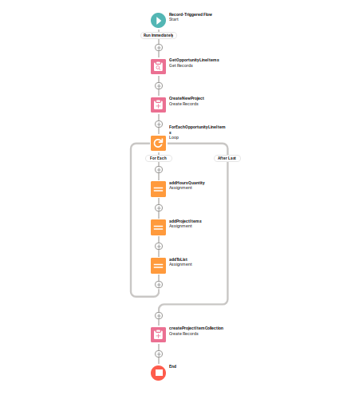
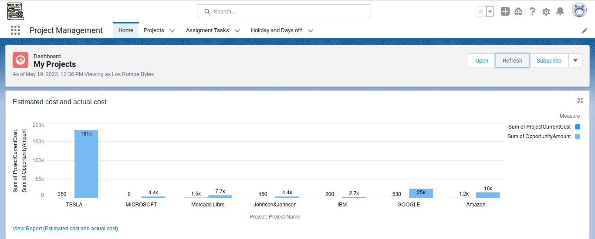
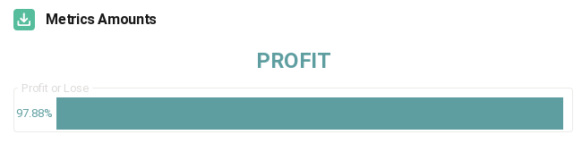
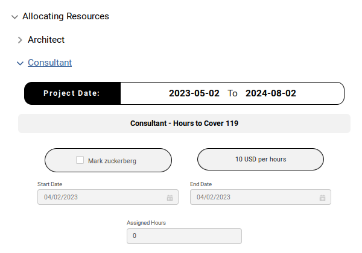
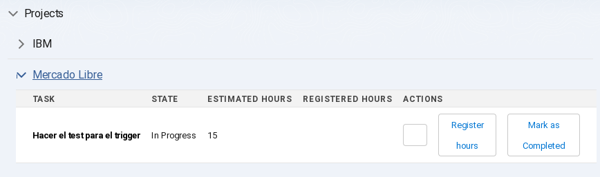
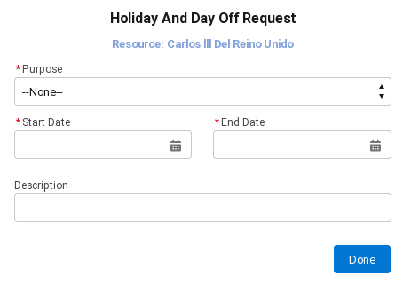

# CLOUD CONSULTING PROJECT 

## Table of Content

- [Team Members](#team-members)
- [Goals](#goals)
- [Model Object and Relations](#model-object-and-relations)
- [Funcionality](#funcionality)
    - [Project creation automation:](#project-creation-automation)
    - [Project Management App](#project-management-app)
    - [Project information display](#project-information-display)
    - [Profit/Loss Management Deployment](#profit/loss-management-deployment)
    - [Resource Allocation](#resource-allocation)
    - [Task Assignment](#task-assignment)
    - [Hours Charge (LWC)](#hours-charge-(lWC))
    - [Request for out of the office](#request-for-out-of-the-office)
    - [Flow Holiday and Days off request](#flow-holiday-and-days-off-request)

## Team Members

- Arturo Petrich.
- Belen Banegas.
- Bernardo Mingoia.
- Johan Revilla.
- Julian Aquino.

## Goals

Build an application with a system that allows Cloud Consulting to manage software projects and get out of the manual processes that they have today through excels, documents and repositories that are not integrated or automated.

## Model Object and Relations

Data model from Schema Builder: [click here](https://losrompebytes-dev-ed.develop.lightning.force.com/lightning/setup/SchemaBuilder/home)

Data model (Diagram): [click here](https://app.diagrams.net/#G15Cen1jPO0dfw5jFGSE4BUlqYc6EBiAWt)

GitHub Owner: [click here](https://github.com/JohanGio92)

## Funcionality

The required functionalities of the project are related to:

### Project creation automation

With a Trigger flow that creates a record of a new project with the Opportunity data when it goes to closed-won.

### Project Management App:

An app was created so that Project Managers can view the projects that were assigned to them with their details. In this app, the Projects tab was created, in which they can assign the necessary resources for each project.

### Project information display

An app was created so that Project Managers can view the projects that were assigned to them with their details. In this app, the Projects tab was created, in which they can assign the necessary resources for each project.

#### Training Area

Reports were created to display specific information about the selected project, in order to facilitate decision making.

#### Reports:

- Assigned hours vs. Hours to cover.
- Percentage of hours to be covered in the project by role.
- Estimated Hours vs Allocated Hours.

### Profit/Loss Management Deployment

Within the Project Management App, in the Project tab an LWC is added that shows with a reactive graph the percentage of "PROFIT" or "LOSS" depending on the estimated costs of the project and the hours sold.

### Resource Allocation

The Project Managers will be able to assign resources to their projects, in said location the availability of the resource will be taken into account, considering role, hours and dates. It has validations in which the assignment end date must not be less than the start date, it must have hours and the resource must be selected to be able to send the data. Also, more hours cannot be assigned than must be covered.

### Task assignment

By registering the project we have the assignment of tasks as a related list, which facilitates the functionality of this point. These can only be assigned when the project is in “In Progress”.

### Hours Charge (LWC):

The development team has created a very useful tool that allows users to manage their projects more efficiently. With this tool, resources can view all the pending tasks in each of the projects in which they are in a clearer and more organized way.

The tool is extremely friendly for the user experience as it provides an intuitive interface that gives resources the ability to quickly identify pending tasks involved with each project, record hours worked, and mark tasks as completed with just a click of a button.

### Request for out of office

The Resource has the possibility of uploading their request for vacations or days off in the Home tab of their own "Resource" application.

In this section you will find an interface where you can insert the purpose of your request, which can be Holiday or Days Off, the dates you want to have them on, a description if necessary. When finished, he sends the request and a notice that has already been sent successfully is returned.

### Flow Holiday and Days off request

**Flow Send Email When I'ts approved:** send a email for approval to the whole team members. 

***Thank You***

### Los Rompe Bytes Team

